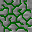

# Доработки ревизии — 2026-10-05

## Руды: проблема ссылок, не рисунка

Шесть `models/block/*_infused_stone.json` указывают на `block/infusedorestone` и `block/infusedore`. Этих двух файлов нет в modern-ресурсах. Родительская модель использует первый как камень и частицы, второй как внешний окрашиваемый слой.

Реальные PNG уже существуют: `textures/block/infusedorestone_{air,fire,water,earth,order,entropy}.png`. Это готовые цветные рисунки руды. Их изображения представлены ниже без изменения пикселей. Простая замена обеих ссылок на одну картинку не годится: нынешняя модель рассчитана на два слоя и повторное окрашивание.

| Воздух | Огонь | Вода |
|---|---|---|
|  |  |  |

| Земля | Порядок | Хаос |
|---|---|---|
|  |  |  |

Предложение на рассмотрение пользователя: сохранить эти рисунки и согласовать модель с готовой цветной текстурой (без лишнего повторного tint), либо восстановить исходную двухслойную схему после сверки ресурсов оригинала. Новые рисунки не нужны. В этом коммите модели и PNG руд не меняются.

## Рецепты

Все 54 существующих JSON-рецепта связаны с главами через `common/research/BookRecipeCatalog`. Специальные arcane/crucible/infusion используют собственные требования исследований, обычные получают явные привязки:

| Глава | Добавленное покрытие |
|---|---|
| Начала тауматургии | Динамическая сборка жезлов с настоящими результатом, расположением деталей и стоимостью vis |
| Руды | Переплавка янтарной руды и киновари |
| Растения | Доски великого и серебряного дерева |
| Тигель | Переплавка сбалансированного осколка в Salis Mundus |
| Таумий / пустотный металл | Упаковка и распаковка слитков, самородков и существующего блока |
| Исследования / перегонка | Флаконы, принадлежности и пополнение чернил |

Для переплавки показаны ингредиент, печь, результат, время и опыт. Для динамического жезла показываются согласованные варианты, вычисленные существующим рецептом. Каталог не придумывает рецепты ещё не перенесённых устройств и не меняет условия крафта.

## Записки

Убрано ограничение шести исходных аспектов. Первые шесть позиций сохранены для совместимости, дополнительные занимают свободные позиции. Сервер защищает все исходные клетки и проверяет связность полного набора. Старые записки с шестью исходными клетками дополняются при нахождении в инвентаре игрока или открытом столе. Если новая исходная клетка замещает ранее поставленный аспект, возвращается одно очко этого аспекта. Повторного возврата нет; чернила и бумага при обновлении не расходуются.

Это исправление числа обязательных аспектов, не завершение всех особенностей оригинальной мини-игры: бонусы окружения, случайные дырки, Expertise и копирование остаются в очереди.

## Локализация и каталог

Переведены пользовательские строки узлов ауры, недостатка Вис на верстаке, debug-команд аспектов и новые подписи переплавки. Ключи присутствуют в EN/RU; имена аспектов и синтаксис команд не переводятся.

По прямому решению пользователя все исследования остаются в каталоге, включая ещё не перенесённые. Никаких фильтров по готовности и удаления записей не добавлено: во время игрового теста они служат перечнем будущих работ.

## Конкретные устаревшие утверждения документов

| Документ | Прежнее утверждение | Что есть в коде сейчас |
|---|---|---|
| WAND_AUDIT.md | «Полные рецепты изготовления остальных стержней/наконечников … ещё не перенесены» | Arcane/infusion-рецепты старших обычных деталей и серверные research gates |
| WAND_AUDIT.md | «Исследовательские записки и шестигранная головоломка … пока не перенесены» | ResearchNotes, ResearchMenu, ResearchScreen и проверенный C2S-пакет действий |
| SURVIVAL_PROGRESSION.md | «Метательный снаряд алюментума этим этапом не реализован» | AlumentumItem и AlumentumProjectile, бросок/взрыв и проверки mobGriefing |
| RESEARCH_AUDIT.md | «Книга не рисует встроенные IMG-иллюстрации» | BookPageLayout разбирает IMG и рисует проверенные области изображений |
| LOCALIZATION.md | «Иллюстрации пока не рисуются» | Та же реализованная поддержка IMG |
| KNOWN_ISSUES.md | Перечень ошибок порта 1.12.2 | Это другой source set; документ прямо указывает 1.12.2 и не является текущим списком modern-проблем |

В первые четыре документа добавлены датированные уточнения. Старые результаты тестов сохранены как история, а не выданы за свежие.

## Проверка

- build и 52 обязательных GameTest: успешно; четыре новые проверки покрывают все существующие рецепты, полный набор исходных аспектов, действительное решение с восемью узлами и обновление старой записки без повторного возврата очков.
- Локализация: 944 EN/RU ключа, 754 ссылки UI/книги, без пропусков и несовпадений форматов.
- Полный каталог исследований и ресурсы руд не изменены.
- Клиентский внешний вид новых страниц требует проверки в игре; GameTest не проверяют рендер.
